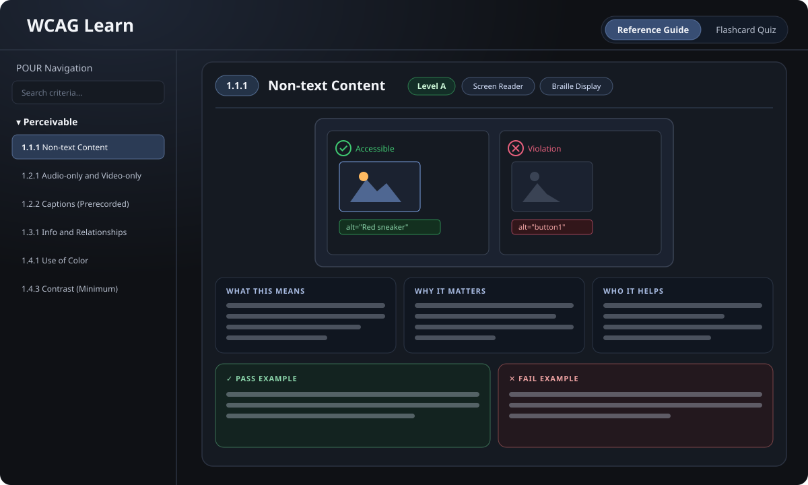

# WCAG Learn

An interactive study and quick-reference app for the **Web Content Accessibility Guidelines (WCAG) 2.1 & 2.2**, Levels A and AA. Flip through illustrated reference cards or test yourself with a scored flashcard quiz — and because it's a tool for learning accessibility, the app is built to meet WCAG 2.2 AA itself.

**Live:** https://wcaglearn.com/



## What it does

**Reference Guide** — A card for every one of the 55 Level A/AA success criteria — plus the retired 4.1.1 Parsing as a historical note — each with:
- a custom illustration contrasting an accessible example with a violation
- plain-language sections (*What this means · Why it matters · Who it helps*)
- concrete pass/fail examples
- conformance level, assistive-technology tags, and a "New in 2.2" badge where relevant

**Flashcard Quiz** — Rounds of 10 four-option questions across six formats (match the ID, the title, the description, the conformance level, the POUR principle, or spot the violation in a real-world scenario), with:
- first-try scoring and an end-of-round summary with cross-session mastery tracking
- "Practice weakest" to re-drill what you keep getting wrong — this round or any before it
- principle and level filters to scope a round

**Navigation & input**
- POUR-organized sidebar with type-to-filter search (criterion numbers, titles, or concepts like "alt text")
- Keyboard shortcuts: arrow keys move between cards, number keys answer quiz questions
- Auto-resume: reload or come back later and pick up exactly where you left off

## Accessibility

The interface is built to model the guidelines it teaches. It targets **WCAG 2.2 AA** and has been checked with automated tooling (axe), browser zoom, colour-contrast and text-spacing tests, VoiceOver, and keyboard-only navigation. Notable details:

- Skip link that lands focus in the main content (works with Enter **and** Space)
- Focus-trapped, Escape-dismissible image dialog that restores focus on close
- Visible focus styles, semantic landmarks/headings, and scoped live regions
- `prefers-reduced-motion` support

See the in-app [Accessibility statement](https://wcaglearn.com/accessibility).

## Tech stack

- [Next.js 14](https://nextjs.org/) (App Router) · React 18 · TypeScript
- No runtime dependencies beyond React/Next — content is a local JSON dataset and the illustrations are hand-built SVGs
- Statically exported; deployed on [Vercel](https://vercel.com/)

## Getting started

Requires Node.js 18+.

```bash
npm install      # install dependencies
npm run dev      # start the dev server at http://localhost:3000
```

Other scripts:

```bash
npm run build    # production build
npm start        # serve the production build
npm run lint     # run ESLint
```

## Project structure

```
app/
  page.tsx            Top-level HomePage: holds all state and logic
  Sidebar.tsx         POUR navigation + search
  ReferenceCard.tsx   Illustrated reference card
  Quiz.tsx            Filters, question card, options, feedback
  QuizSummary.tsx     End-of-round results
  ImageOverlay.tsx    Expandable image dialog (self-contained focus trap)
  wcag.ts             Shared types, constants, and pure helpers
  about/              "Learn more & sources" page
  accessibility/      Accessibility statement page
  globals.css         Theme and layout
data/
  wcag.json           All success criteria: content, examples, search keywords
public/images/        Per-criterion SVG illustrations
```

## Content & sources

All criteria, explanations, and examples are based on the official **W3C WCAG 2.2 specification**, published by the W3C Web Accessibility Initiative (WAI). The wording is simplified for study; the requirements are not. For formal audits, refer to the official documents linked from the in-app [About & sources](https://wcaglearn.com/about) page — they take precedence over any summary here.

## Feedback

It's a work in progress. Found something that trips you up, or have an idea to make it better? [Open an issue](https://github.com/1Salasfamily/WCAG-Learn/issues).
